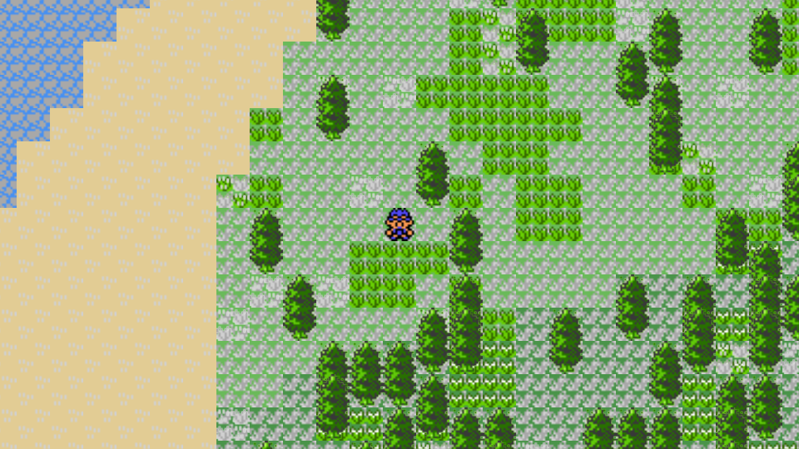
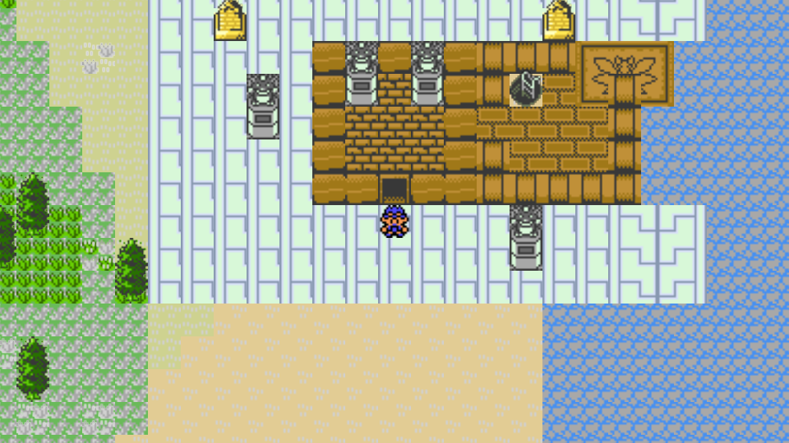
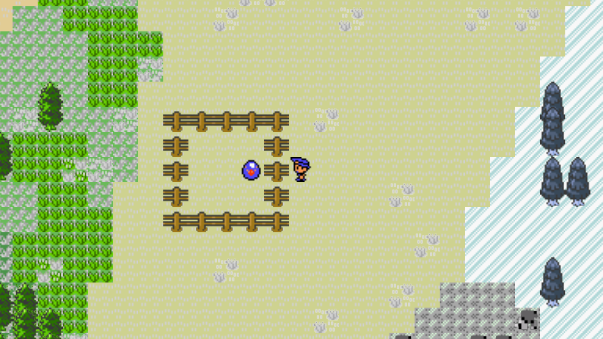

# PokeWilds

PokeWilds is an open Pokémon survival sandbox. There are no gyms, trainers, or Pokémon Centers. You live in the wilds.

## Play it

1. Open the [latest release](https://github.com/ThomsenDrake/poke-wilds-gd/releases/latest).
2. Download the file for your computer: `PokeWilds-windows.exe`, `PokeWilds-macos.zip`, or `PokeWilds-linux.x86_64`.
3. Do not download the Source code zip or tar.gz. Those are project files, not the game, and they will not run it.

If you downloaded the macOS zip, unzip it. On macOS, Control-click the app, choose Open, and confirm the warning — this build is not signed. On Linux, mark `PokeWilds-linux.x86_64` as a program first (`chmod +x PokeWilds-linux.x86_64`). Then open the Windows, macOS, or Linux game file.

## Keys

- Move: arrow keys or WASD
- `Z`: confirm, harvest, and use what is in front of you
- `X`: cancel; hold it to run
- `Enter`: open the menu
- `C`: build

## What you do

Explore, harvest, build, camp, craft, rest, fish, breed, fight and catch, and visit landmarks.

## This is an early alpha

This early alpha is incomplete, and there will be many bugs.

- You cannot switch Pokémon in battle
- Grass battles stay off until you turn them on in Options
- Charm and Attack are mostly missing from the FIELD menu
- Heart Tower is unfinished
- You only have Poké Balls

## Credit

PokeWilds was created by SheerSt. This is an unofficial fan remake and is not affiliated with Nintendo or Game Freak.
