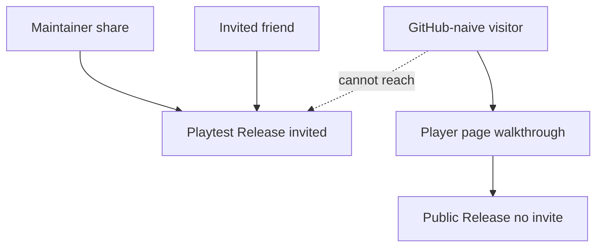
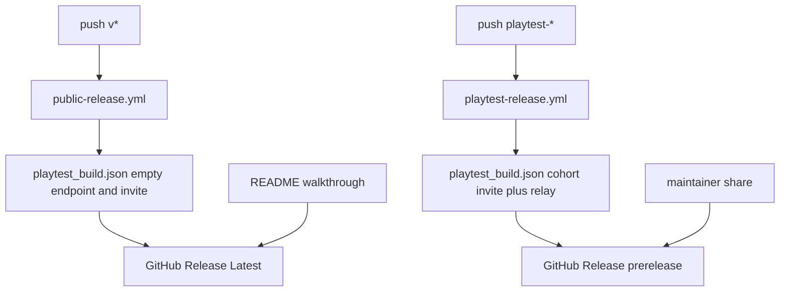
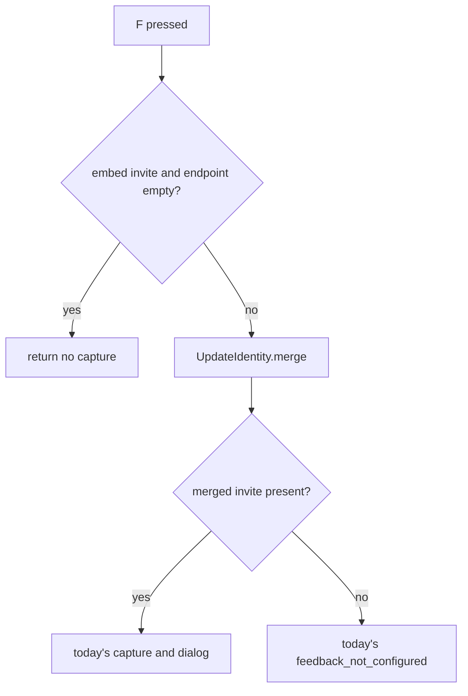

# Player README Storefront - Plan

## Goal Capsule

- **Objective:** Someone who has never used GitHub can understand PokeWilds, download a public desktop build, and start playing. They see unofficial SheerSt credit. Following only the player page, they cannot send feedback or download the invited playtest build.
- **Means:** Player-facing `README.md` plus two GitHub Release namespaces: `v*` as Latest, `playtest-*` as prerelease. (KTD1, KTD2)
- **Product authority:** This plan owns the player page and the two-Release rule. Friend-invite handoff copy and the full controls manual are not active scope.
- **Execution profile:** Standard Durable. One ship: runtime isolation, then both publish paths, then the player page. The walkthrough must not merge before a public `v*` Release exists.
- **Stop conditions:** Do not invent a public report channel. Do not hide playtest Releases. Do not reuse the playtest workflow with `--require-cohort` off. Do not restore persisted playtest identity onto a tokenless public embed.
- **Tail ownership:** `ce-work` (or equivalent) executes the units. The first public tag is a maintainer push after U1–U3 land.

---

## Product Contract

### Summary

Replace the repository front door with a player storefront for a GitHub-naive visitor, and ship two GitHub Releases so that visitor can play a public build while friends get a separate invited playtest build.

### Problem Frame

The current front door describes a Godot harness for agents. A first-time visitor cannot tell what the game is, how to run it, or that SheerSt's PokeWilds is the original. There is no public Release to download. The shared playtest build embeds an invite, so the same artifact would let a stranger file feedback. No one has used the repo yet; this is for that first visitor and for friends who should not share a download with them.

### Key Decisions

- **Public desktop downloads, not source-only or a read-only page.** (session-settled: user-directed — chosen over source-only and read-now-download-later: a stumble-upon visitor should play.) Governs R1, R10.
- **Three-step GitHub Releases walkthrough.** (session-settled: user-directed — chosen over direct file buttons and an off-GitHub host: stay on GitHub and teach the clicks, including not taking Source code.) Governs R6, R7.
- **This plan owns the page and the two-artifact rule.** (session-settled: user-directed — chosen over README-only: the page must not lie.) Governs R10, R11, R12.
- **Public `F` is a no-op and the page never mentions it.** (session-settled: user-directed — chosen over an honest refuse and removing the key: strangers get no report path and no prompt to look for one.) Governs R9, R14, R15.
- **Two Releases, not one page with two names.** (session-settled: user-directed — chosen over public-only Releases and same-Release dual assets: a first-time visitor should not be able to click the invited file.) Governs R11, R12, R13.
- **Walkthrough isolation, not invisibility.** (session-settled: user-directed — chosen over moving playtest off GitHub: playtest stays a published prerelease; `/releases` can list it; A1 following only the page cannot reach it.) Governs R13.
- **SheerSt credit plus unofficial / not Nintendo.** (session-settled: user-directed — chosen over credit-only and a do-not-redistribute ask.) Governs R16.
- **Honest missing-list plus many bugs.** (session-settled: user-directed — chosen over a badge-only label and a soft one-caveat blurb.) Governs R17.
- **Mini key card only.** (session-settled: user-directed — chosen over a link to the full manual and no keys: five keys are enough to start.) Governs R8.
- **Keep the full named set.** (session-settled: user-directed — chosen over cutting for a smaller page.) Governs R2, R3, R4, R5, R8, R16, R17.

### Actors

- A1. GitHub-naive visitor — has never used GitHub; wants to understand the game and play.
- A2. Maintainer — publishes both Releases and shares the playtest tag with friends.
- A3. Invited friend — receives the playtest tag from A2, not from the repository front door.

### Requirements

**Player page**

- R1. The repository front door is a non-technical player overview of the game, not a harness or agent map.
- R2. The page states what the game is in plain language: an open Pokémon survival sandbox with no gyms, trainers, or Pokémon Centers.
- R3. The page describes the core loop a player can do today: explore, harvest, build, camp, craft, rest, fish, breed, fight and catch, and visit landmarks.
- R4. The page includes pleasant screenshots of the live game.
- R5. Agent, contributor, and validation setup content does not appear on this page.
- R6. The page includes a three-step walkthrough that gets A1 from the repository to a running public build: open the public Release, pick their OS file, ignore Source code.
- R7. The walkthrough names the three desktop files a visitor should expect (Windows, macOS, Linux) and warns that Source code will not run the game.
- R8. The page prints a mini key card only: move (arrows or WASD), `Z`, `X`, `Enter`, `C`.
- R9. The page does not mention `F`, reporting, invites, or the playtest Release.

**Two Releases**

- R10. A public GitHub Release exists with Linux, Windows, and macOS desktop builds that A1 can install and play.
- R11. The public Release embeds no feedback invite.
- R12. A separate playtest GitHub Release exists for A3, with an invite so `F` can send reports. A2 shares that tag; the player page does not link to it.
- R13. A1 following only the player-page walkthrough cannot download the invited playtest build.

**Public build behavior**

- R14. On the public build, `F` does nothing. No report dialog, no failure toast, no copy that a report could not be sent.
- R15. A3's invited build keeps `F` as a working report key.

**Attribution and alpha**

- R16. The page credits SheerSt for the original PokeWilds and states this is an unofficial fan remake, not affiliated with Nintendo or Game Freak.
- R17. The page lists what is missing in this early alpha — no in-battle party switch, grass battles off until Options, Charm and Attack mostly not in the FIELD menu, Heart Tower unfinished, Poké Balls only — and says there will be many bugs.

### Key Flows

- F1. First visit and play
  - **Trigger:** A1 opens the repository.
  - **Actors:** A1
  - **Steps:** Read what the game is and that it is early alpha. Follow the three-step walkthrough to the public Release. Download their OS file, not Source code. Unzip or run it. Use the five keys to start playing.
  - **Outcome:** A1 is in the game from a tokenless public build.
  - **Covered by:** R1, R2, R6, R7, R8, R10, R11, R13

- F2. Friend playtest
  - **Trigger:** A2 wants friends to play and report.
  - **Actors:** A2, A3
  - **Steps:** A2 shares the playtest Release, not the player-page walkthrough. A3 downloads that build. `F` sends a report.
  - **Outcome:** A3 can play and give feedback. A1 never saw this path on the player page.
  - **Covered by:** R9, R12, R15

- F3. Public `F` press
  - **Trigger:** A1 presses `F` on the public build.
  - **Actors:** A1
  - **Steps:** Nothing visible happens. Play continues.
  - **Outcome:** No report is created or queued.
  - **Covered by:** R14

### Acceptance Examples

- AE1. Wrong zip
  - **Covers R6, R7.**
  - **Given:** A1 is on the public Release page.
  - **When:** They are about to download.
  - **Then:** The walkthrough they just read tells them to take the Windows, macOS, or Linux game file and not Source code.

- AE2. Stranger cannot get the invited build
  - **Covers R9, R12, R13.**
  - **Given:** A1 uses only the player page.
  - **When:** They complete the walkthrough.
  - **Then:** They land on the public Release and have no link or mention of the playtest Release.

- AE3. Public `F` is silent
  - **Covers R9, R14.**
  - **Given:** A1 is in the public build, including on title, overworld, menu, or battle.
  - **When:** They press `F`.
  - **Then:** No dialog, toast, or report artifact appears.

- AE4. Friend `F` still works
  - **Covers R15.**
  - **Given:** A3 is in the invited playtest build.
  - **When:** They press `F` and send a short message.
  - **Then:** The report can be sent as today's invited playtest path already does.

- AE5. Alpha list prevents "broken download" confusion
  - **Covers R17.**
  - **Given:** A1 has read the player page.
  - **When:** They find no in-battle party switch and no random grass battles.
  - **Then:** The page already named those gaps and said there will be many bugs.

- AE6. Agent map is gone
  - **Covers R1, R5.**
  - **Given:** A1 opens the repository front door.
  - **When:** They scan the page.
  - **Then:** They do not see validation commands, layer layout, or agent start-here lists.

### Scope Boundaries

- Deferred for later: rewriting the full controls manual; a one-page friend brief; a public report channel; in-game party switch, FIELD Attack/Charm, Heart Tower, and ball tiers as features (they are named only as alpha honesty).
- Outside this work: an off-GitHub storefront; direct-to-file download buttons; a do-not-redistribute ask; hiding `F` by removing the key from public binaries (the key may exist; it must do nothing); hiding published playtest Releases from `/releases`.

<!-- ce-section: work-relationships -->
### How This Work Fits Together

This plan owns the player storefront and the two-Release split. Adjacent playtest-readiness work can proceed separately.

- Friend briefing copy
  - **Can proceed independently of** this plan
  - **Shares** the playtest Release in R12
- Full controls manual
  - **Can proceed independently of** this plan
  - **Shares** the five keys in R8 as a subset, not a link
- Licensing posture beyond the unofficial line in R16
  - **Still to decide** as a project-owner call outside this page
- Playtest GitHub environment secrets
  - **Blocks R12 only** until `PLAYTEST_FEEDBACK_ENDPOINT` is set; does not block R10

### Dependencies / Assumptions

- The walkthrough is false until R10 is true. No public Release exists today.
- No visitor has used the current front door. Success is untested with real strangers.
- Pleasant screenshots come from the existing docs-only showcase frames in `docs/generated/showcase/` if they still look like the live game.
- `STRATEGY.md` remains the product direction: players are primary; the harness is not the product.
- R13 is walkthrough isolation (AE2), not invisibility. A visitor who opens `/releases` can see a published playtest prerelease.

### Product Contract preservation

Planning enriched this file in place. R1–R17, A1–A3, F1–F3, and AE1–AE6 are unchanged. The isolation Key Decision records the planning-time reading of R13. Outstanding Questions from the requirements-only draft are resolved in the Planning Contract.

---

## Planning Contract

### Key Technical Decisions

- KTD1. **Tag namespaces split Latest from playtest.** Public tags are `v*`, published as a full Release so `/releases/latest` is the public build. Playtest tags are `playtest-*`, published with `--prerelease`. One git tag is one Release; they cannot share `v*`. (session-settled: user-directed — instantiates walkthrough isolation for R13: Latest walkthrough over hiding playtest.)
- KTD2. **Walkthrough deep-links Latest.** The three steps open `https://github.com/ThomsenDrake/poke-wilds-gd/releases/latest`, name `PokeWilds-windows.exe`, `PokeWilds-macos.zip`, and `PokeWilds-linux.x86_64`, and warn that the Source code zip/tar.gz GitHub always attaches will not run the game. After those steps, one sentence: unzip the macOS zip if needed, then open the game file. The page never links `/releases` or a `playtest-*` tag. (session-settled: user-directed — instantiates the three-step walkthrough for R6, R7, R13.)
- KTD3. **Public `F` returns before capture.** `FeedbackController._input` exits before `_begin_capture()` when the embedded stamp has no invite and no endpoint. No pause, dialog, toast, handled-as-report, or `feedback_capture_requested`. Invited builds keep today's path. A tokenless Godot Export matches the public stamp and becomes silent too. Invite-present / endpoint-missing still uses today's `feedback_not_configured` unsaved path.
- KTD4. **Tokenless public stamp does not restore playtest identity.** `UpdateIdentity.merge` copies persisted `user://playtest_identity.json` only when the embed has an invite or a nonempty endpoint. A public stamp (empty invite and empty endpoint) stays empty, so a machine that once ran playtest cannot `F` or grow an UPDATE row from the public binary. Playtest `--require-cohort` still forbids tokenless invited publishes.
- KTD5. **Public publish is a second path, not playtest with cohort off.** Add `--embed-public` (name may vary) on `tools/publish_update.py`: export the three OS artifacts, write empty `endpoint` and empty `invite_token`, skip invite register, Cloudflare R2 upload, and manifest publish. `main()` must not require `PLAYTEST_FEEDBACK_ENDPOINT` or admin token on that path. The public flag must ignore those variables and `PLAYTEST_COHORT_INVITE_TOKEN` when they are set in the process environment. Do not call today's `main()` without `--require-cohort`; that path still writes a relay endpoint.
- KTD6. **Public workflow has no playtest secrets.** New `.github/workflows/public-release.yml` triggers on `v*` (and `workflow_dispatch` if a tag is present). It must not use `environment: playtest-release` and must not mention cohort, admin, or Cloudflare secrets. Playtest workflow keeps `--require-cohort` and those secrets; its tag trigger moves from `v*` to `playtest-*`; `gh release create` for playtest adds `--prerelease`.
- KTD7. **Page order is two-minute play, then honesty.** `README.md` order: what the game is (R2), hero shot `docs/generated/showcase/08_biome_vista.png`, three-step Latest walkthrough (R6, R7), mini key card (R8), core loop (R3) plus `03_ruins_exterior.png` and `07_pen_eggs.png`, alpha missing-list and "many bugs" (R17), SheerSt plus unofficial / not Nintendo / not Game Freak (R16). No `CONTROLS.md` link. No Heart Tower shot; the alpha list names it.
- KTD8. **Agent map moves in the same unit as the player page.** `AGENTS.md` "Repo overview" stops pointing at `README.md` and points at `STRATEGY.md` plus `docs/product-specs/`. Canonical commands stay in `AGENTS.md`. `check_repo_contracts.py` gains a README content pin that forbids mentioning `F`, reporting, invites, and the playtest Release, plus no `verify_all` / harness Start Here, and pins both workflows' tag namespaces.

### High-Level Technical Design

Public and playtest are two publish graphs. They share Godot export and the three stable asset names. They do not share tag namespace, GitHub Latest, relay secrets, or embedded identity.

Runtime isolation is a stamp check, then identity merge, then input.

UPDATE already skips the network when the unmerged embed endpoint is empty (`update_runtime.gd`). KTD4 is what keeps merge from filling that hole for `F`.

### Assumptions

- Showcase frames `08`, `03`, and `07` remain docs-only and still look like the live game; this plan does not recapture them.
- `/releases/latest` continues to mean newest non-prerelease, non-draft Release.
- A2 will set `PLAYTEST_FEEDBACK_ENDPOINT` before the first `playtest-*` Release after the tag rename. That is outside U2.
- Local tokenless Export becoming a silent `F` is accepted. It matches R14's stamp rule and the existing "do not send Godot Export" guidance.

### Implementation constraints

- `scripts/app/feedback_controller.gd` is under a 220-line budget; keep the silent gate tiny or extract.
- `scripts/app/feedback_flow_scenario.gd` is at 220/220; public-vs-invited branches belong in `feedback_flow_resilience_checks.gd` or a new extracted checks file owned by `feedback_reporting`.
- `scripts/app/update_flow_checks.gd` is at 220/220; do not add the KTD4 case there.
- `check_repo_contracts.py` `playtest_release_workflow_issues()` currently requires `'      - "v*"'` and `"Resolve a v* tag on this SHA"`. Those pins must move with U3.
- `AGENTS.md` is at 119/120 lines; the overview rewire must stay in budget.
- Do not print or commit `PLAYTEST_COHORT_INVITE_TOKEN` values.
- Do not add a mechanical pin that forbids the word `F` in `CONTROLS.md` or specs; the pin is the player `README.md` only.

### Sequencing

U1 before any public binary. U2 and U3 land in the same PR and must not share a workflow file. Do not push a `v*` tag until playtest-release no longer triggers on `v*` and public-release does. U4 merges only after `/releases/latest` serves the three desktop files. A live Release is not U2 proof.

### System-Wide Impact

- **Agent map:** `AGENTS.md` is the machine entry after U4. Any tool or prompt that still says "start at README" will send agents into player copy.
- **Identity file:** `user://playtest_identity.json` remains on disk after a public binary runs. KTD4 must keep merge from reading it on a public stamp. A later invited binary may still load it; that is today's playtest behavior.
- **GitHub Latest:** After U3, any full (non-prerelease) Release steals Latest. Do not publish a playtest tag as a full Release.
- **Secrets boundary:** Public CI must not inherit `playtest-release`. A copy-paste of the playtest workflow that only drops `--require-cohort` leaks the invite into the public embed (KTD5).
- **Trace contract:** Silent public `F` must not emit `feedback_capture_requested`. Invited captures keep that event.

### Risks & Dependencies

- **Empty playtest environment.** The last `playtest-release` run failed because `PLAYTEST_FEEDBACK_ENDPOINT` was empty. R12 stays blocked until A2 sets that secret. R10 does not wait on it.
- **Existing `v*` mental model.** Humans and docs still say "cut a v tag for playtest." After U3, a `v*` tag publishes the public (tokenless) build. Cutting `v*` out of habit ships a silent-`F` binary to friends who expected invited `F`.
- **Draft vs published.** A draft Release hides from visitors and from friends without write access. Both Releases in this plan are published.
- **Source code archives.** GitHub always attaches source zip/tar.gz. The walkthrough must keep the warning or A1 downloads a tree they cannot run.

---

## Implementation Units

### U1. Public F silent gate and identity isolation

- **Goal:** A public stamp cannot open `F` or inherit a prior playtest identity. An invited stamp keeps today's report path.
- **Requirements:** R14, R15, F3, AE3, AE4. Key Decisions: public `F` is a no-op; invited `F` stays.
- **Files:** `scripts/app/feedback_controller.gd`, `scripts/runtime/feedback_reporter.gd`, `scripts/runtime/update_identity.gd`, `scripts/runtime/feedback_bundle.gd` (only if the merge call site must pass the public-stamp rule), `scripts/app/feedback_flow_resilience_checks.gd`, `scripts/app/feedback_flow_scenario.gd` if a one-line dispatch is required, `scripts/app/update_flow_scenario.gd`, `docs/product-specs/playtest-feedback.md`, `docs/product-specs/game-update.md`, `docs/QUALITY_SCORE.md` rows `feedback_reporting` and `game_update`, `docs/registry/subsystems.toml` comments for those subsystems.
- **Approach:** Implement KTD3 and KTD4. Gate on the unmerged embed (empty invite and empty endpoint), not on merged identity. Read that stamp through a thin reporter wrapper around the existing bundle instance (`smoke_set_build_info` already mutates it). Split `_missing_configuration_contract`: public stamp asserts no dialog and no `feedback_capture_requested`; invite-without-endpoint keeps unsaved `feedback_not_configured`. Seed an invited override before the existing screen-capture loop so those presses stay on AE4. Put the KTD4 assertion in `update_flow_scenario.gd` as a direct `UpdateIdentity.merge` of an empty public stamp plus persisted cohort; do not add lines to `update_flow_checks.gd` (220/220). Do not change invited merge when the embed has an invite or a nonempty endpoint.
- **Test scenarios:**
  - Happy: invited embed, `F` on title, dialog opens, submit can send (AE4).
  - Happy: public embed, `F` on title/overworld/menu/battle, nothing visible (AE3).
  - Edge: public embed on a machine with persisted `playtest_identity.json`; merge result has empty invite and empty endpoint; `F` stays silent.
  - Edge: `LineEdit` focus still treats `F` as text on invited builds.
  - Error: invite present, endpoint empty; dialog opens; submit is `feedback_not_configured`; no outbox files.
  - Integration: `feedback_flow` remains in `PLAYTEST_SCENARIOS`; both branches run in one scenario.
- **Verification:** `python3 tools/godot_dap_smoketest.py --project <abs> --scene res://scenes/app/Main.tscn --scenario feedback_flow` and `--scenario update_flow`. `python3 tools/check_change_contract.py`.

### U2. Public publish path

- **Goal:** CI can export three desktop binaries whose embed has no invite and no relay, then attach them to a `v*` Latest Release.
- **Requirements:** R10, R11, F1. Key Decision: this plan owns the two-artifact rule.
- **Files:** `tools/publish_update.py`, `tools/test_publish_update.py`, `.github/workflows/public-release.yml`, `tools/check_repo_contracts.py`, `docs/product-specs/game-update.md`, `docs/RELIABILITY.md` publish notes, `docs/QUALITY_SCORE.md` `game_update` row, `docs/registry/subsystems.toml` `game_update`.
- **Approach:** Implement KTD5 and KTD6's public half. New workflow copies Godot restore/import/export shape from playtest-release where needed, then calls the public flag only. Require a green `playtests-headless` on the SHA. Do not wait on `feedback-relay-deploy`. Attach the three stable names from the local receipt via `stage_github_release_assets` only; if the Release exists, `gh release upload --clobber`, otherwise `gh release create` without `--prerelease`. Notes name the three desktop files and omit `F`, reporting, invites, and playtest. Do not call `fetch_latest` or `stage_github_release_from_latest`, and do not set `PLAYTEST_FEEDBACK_ENDPOINT`. Pin the new workflow in `check_repo_contracts.py`: `v*` trigger, no `playtest-release` environment, no cohort/admin/Cloudflare/`PLAYTEST_FEEDBACK_ENDPOINT` secrets, no `fetch_latest` / `stage_github_release_from_latest`, public publish flag present, `--require-cohort` absent.
- **Test scenarios:**
  - Happy: `--embed-public` writes empty `endpoint` and empty `invite_token` and does not call register/upload/manifest.
  - Happy: receipt lists linux/windows/macos and contains no invite/token strings.
  - Edge: `--embed-public` succeeds with `PLAYTEST_FEEDBACK_ENDPOINT` unset.
  - Edge: `--embed-public` still writes empty `endpoint` and empty `invite_token` when `PLAYTEST_FEEDBACK_ENDPOINT` and `PLAYTEST_COHORT_INVITE_TOKEN` are set in the process environment.
  - Error: `--require-cohort` still refuses an empty `PLAYTEST_COHORT_INVITE_TOKEN` (existing test stays).
  - Integration: contract test fails if the public workflow gains playtest secrets, names `PLAYTEST_FEEDBACK_ENDPOINT`, or loses `v*`.
- **Verification:** `python3 tools/test_publish_update.py`. `python3 tools/check_repo_contracts.py`. First real `v*` tag after U3 is the live R10 proof.

### U3. Playtest tag namespace and prerelease

- **Goal:** Playtest publishes cannot become GitHub Latest and cannot collide with public `v*` tags.
- **Requirements:** R12, R13, F2, AE2. Key Decision: walkthrough isolation, not invisibility.
- **Files:** `.github/workflows/playtest-release.yml`, `tools/check_repo_contracts.py`, `docs/RELIABILITY.md`, `docs/product-specs/playtest-feedback.md`, `docs/QUALITY_SCORE.md` `feedback_reporting` / `game_update` rows if they name `v*`.
- **Approach:** Implement KTD1 and KTD6's playtest half. Change `on.push.tags` and the "Resolve a … tag" step from `v*` to `playtest-*`. Add `--prerelease` to `gh release create`. Keep `--require-cohort`, `environment: playtest-release`, and relay waits. Update every contract fragment that currently requires `v*` on this workflow.
- **Test scenarios:**
  - Happy: contract accepts `playtest-*` plus `--prerelease` on playtest-release.
  - Error: contract fails if playtest-release still triggers on `v*` or omits `--prerelease`.
- **Verification:** `python3 tools/check_repo_contracts.py`. Maintainer creates a `playtest-*` tag only after the GitHub environment has a nonempty `PLAYTEST_FEEDBACK_ENDPOINT`. Live Latest vs prerelease is the Verification Contract Live Releases gate, not this unit's automated test.

### U4. Player README and agent-map rewire

- **Goal:** The repository front door is a player storefront. Agents still have a map.
- **Requirements:** R1–R9, R16, R17, F1, AE1, AE5, AE6. Key Decisions: public page, three-step walkthrough, mini keys, named set, SheerSt credit, honest alpha.
- **Files:** `README.md`, `AGENTS.md`, `tools/check_repo_contracts.py`, `docs/RELIABILITY.md` if it cites README as the agent map, `docs/QUALITY_SCORE.md` only if a front-door row exists or the change-contract scan requires it.
- **Approach:** Implement KTD2, KTD7, KTD8. Replace `README.md` wholesale. Use markdown image syntax to the three showcase PNGs, each with nonempty plain-language alt text. Deep-link Latest only. After the three GitHub steps, one player-facing sentence: unzip the macOS zip if needed, then open the Windows, macOS, or Linux game file. Do not mention `F`, reporting, invites, or playtest. Rewire `AGENTS.md` in the same commit. Add the README content pin. Merge this unit only after `/releases/latest` serves the three desktop files.
- **Test scenarios:**
  - Happy: a reader following only README reaches `/releases/latest` and the three OS names (AE1, AE2).
  - Happy: the page states the sandbox line, the named loop, the five keys, the five alpha gaps plus many bugs, and SheerSt / unofficial / not Nintendo / not Game Freak (R2, R3, R8, R16, R17).
  - Edge: README has no `verify_all`, no layer map, no Start Here agent list, no `F` (AE6, R5, R9).
  - Integration: `check_repo_contracts.py` fails if `AGENTS.md` still lists README as repo overview or if README regains harness copy.
- **Verification:** `python3 tools/check_repo_contracts.py`. `python3 tools/check_quality_docs.py`. Visual check of the rendered README images.

---

## Verification Contract

| Gate | Command | Proves |
|---|---|---|
| Repo contracts | `python3 tools/check_repo_contracts.py` | Both workflows, tag namespaces, public-secret absence, README/AGENTS pins |
| Change contract | `python3 tools/check_change_contract.py` | Spec, quality row, subsystem comments stay paid |
| Quality docs | `python3 tools/check_quality_docs.py` | Scorecard/source-path freshness |
| Public publish unit | `python3 tools/test_publish_update.py` | Public embed, tokenless `--embed-public`, `--require-cohort` still refuses playtest |
| Feedback journey | `python3 tools/godot_dap_smoketest.py --project <abs> --scene res://scenes/app/Main.tscn --scenario feedback_flow` | AE3 and AE4 in-engine |
| Update journey | `python3 tools/godot_dap_smoketest.py --project <abs> --scene res://scenes/app/Main.tscn --scenario update_flow` | KTD4 persist isolation |
| Local gate | `python3 tools/verify_all.py --skip-windowed` | Headless full suite after U1–U4; windowed not required for this docs/runtime/CI change |
| Live Releases | GitHub `/releases/latest` after the first `v*` and `playtest-*` | R10, R12, R13: Latest is public; playtest is prerelease |

`feedback_flow` stays in `PLAYTEST_SCENARIOS`. Do not add a new gated scenario unless extraction forces a second name; prefer branches inside the existing journey.

---

## Definition of Done

**Global**

- Page requirements R1–R9 and R16–R17 hold on `README.md` in the merged tree. Release requirements R10–R13 hold on the two published Releases. Runtime requirements R14–R15 hold on the matching public and playtest binaries.
- A1 following only `README.md` lands on Latest and never sees playtest, `F`, or harness commands.
- Public binaries have empty embed invite and endpoint; `F` is silent even when `user://playtest_identity.json` exists.
- Invited `playtest-*` binaries still report with `F`.
- Abandoned export experiments and debug stamps are not in the diff.
- `check_repo_contracts.py`, `check_change_contract.py`, `test_publish_update.py`, `feedback_flow`, and `update_flow` are green.

**Per unit**

- U1: public vs invited `F` branches pass; merge isolation passes; specs/quality paid.
- U2: public workflow and `--embed-public` exist; contract pins them. A live `v*` Release is not this unit's done signal.
- U3: playtest workflow is `playtest-*` plus `--prerelease`; old `v*` pin is gone.
- U4: player README and `AGENTS.md` rewire are live; README contract pin is live; first public Release exists so the walkthrough is true.

---

## Appendix

### Research breadcrumbs

- Current agent front door: `README.md` (includes `F` and `verify_all`).
- Agent map already holds canonical commands: `AGENTS.md`.
- Playtest publish: `.github/workflows/playtest-release.yml` (`CHANNEL: playtest`, `--require-cohort`, `v*` today, `environment: playtest-release`).
- Contract pins: `tools/check_repo_contracts.py` `playtest_release_workflow_issues()`.
- Embed writer: `tools/publish_update.py` `write_shared_build_info()`; `main()` requires endpoint + admin token unless a new public flag is added.
- Tokenless export already tested: `tools/test_publish_update.py` `test_export_shared_writes_tokenless_metadata` (name may vary; asserts empty `invite_token`).
- `F` opens before config: `scripts/app/feedback_controller.gd` `_input` → `_begin_capture()`.
- Config refuse after dialog: `scripts/app/feedback_flow_resilience_checks.gd` `_missing_configuration_contract()`.
- Identity restore on empty embed invite: `scripts/runtime/update_identity.gd` `merge()`; caller `scripts/runtime/feedback_bundle.gd`.
- UPDATE uses unmerged embed endpoint: `scripts/runtime/update_runtime.gd` `_update_endpoint()`.
- Showcase frames: `docs/generated/showcase/08_biome_vista.png`, `03_ruins_exterior.png`, `07_pen_eggs.png` (docs-only, not pixel baselines).
- Specs to pay: `docs/product-specs/playtest-feedback.md`, `docs/product-specs/game-update.md`.
- GitHub Releases: published releases on a public repo are listed on `/releases`; `/releases/latest` is newest non-prerelease non-draft; Source code archives cannot be removed.

### External Latest rule

GitHub Latest is the newest Release that is not a prerelease and not a draft. A later full playtest Release on `v*` would steal Latest. That is why playtest must leave `v*` and set `--prerelease`.
