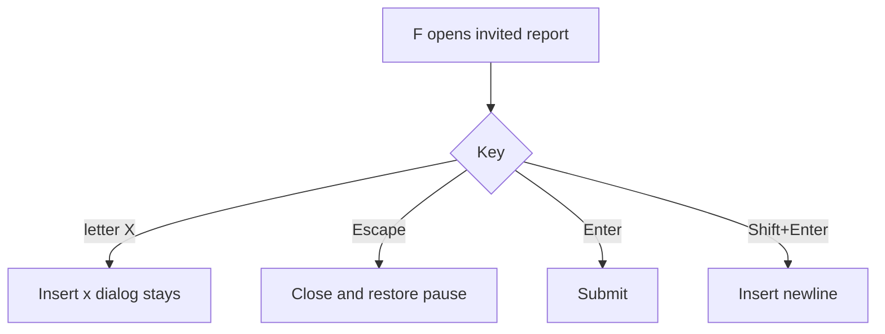
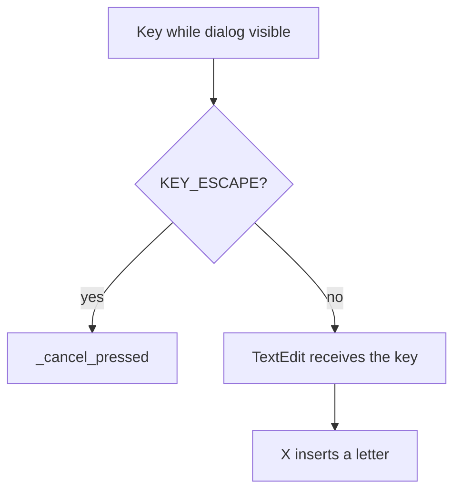

# Feedback Escape-Only Cancel - Plan

## Goal Capsule

- **Objective:** An invited playtester writing an `F` report can type the letter `X`. Escape is the only way to abandon the dialog. The draft is not discarded by the GBC cancel key.
- **Means:** Drop `action_b` / `X` from `FeedbackDialog` cancel handling and from the on-screen hint. Keep Escape. Pin both in the existing `feedback_flow` journey. (KTD1, KTD2, KTD3)
- **Product authority:** This plan owns cancel keys on the feedback dialog only. Menus, battle, build mode, and overworld run keep `X` as `action_b`.
- **Execution profile:** Standard Durable. One ship, one unit. Specs and the journey pin land with the code.
- **Stop conditions:** Do not rebind `action_b` globally. Do not add a window-chrome close widget or click-outside dismiss. Do not change Enter / Shift+Enter. Do not add a new gated scenario name.
- **Tail ownership:** `ce-work` (or equivalent) executes U1.

---

## Product Contract

### Summary

On the invited playtest report dialog, cancel is Escape only. `X` is a letter in the description field.

### Problem Frame

`X` is the shared GBC cancel / run key (`action_b` → `KEY_X`). The report dialog is a focused `TextEdit`. Today `_input` treats `action_b` as cancel even while that field owns focus, and the hint says `Esc/X: Cancel`. A tester cannot type `X` — the key closes the modal and restores play. The existing journey already cancels with Escape, so the `X` path is unpinned and fights the field.

There is no window-chrome close widget. "X as a button" in the request is the keyboard `X` / `action_b` cancel, not a drawn close control.

### Key Decisions

- **Escape-only cancel on this dialog.** (session-settled: user-directed — chosen over keeping GBC `X` cancel and over adding a second visible cancel control.) Governs R1, R2, R4.
- **`X` is text while the report is open.** (session-settled: user-directed — chosen over swallowing `X` with no insert.) Governs R3, AE1.
- **This dialog only.** (session-settled: user-directed — chosen over changing `action_b` everywhere.) Governs R6, AE4.
- **Pay the player-facing hint and both specs.** (session-settled: user-directed — the hint currently advertises `Esc/X`.) Governs R4, R5.

### Actors

- A1. Invited playtester — presses `F`, writes a report, may need the letter `X`, may abandon the draft.
- A2. Maintainer — reads the public issue sentence; needs testers able to name the `X` key.

### Requirements

**Cancel and typing**

- R1. While the invited report dialog is open and not in-flight, Escape cancels even when the description field owns focus.
- R2. `X` / `action_b` does not cancel the report dialog.
- R3. With the description field focused, `X` inserts the letter `x` (Shift+`X` inserts `X`) and leaves the dialog open.
- R4. The open-dialog hint names Escape as the only cancel key. It does not mention `X` as cancel.

**Unchanged report behavior**

- R5. Enter still sends, Shift+Enter still inserts a newline, the 1–1000 character cap stays, and in-flight submit still ignores further send/cancel/reopen.
- R6. Other screens keep `X` as cancel / run. This plan does not change `input_router.gd` bindings.

**Pause and public stamp**

- R7. Cancel via Escape still restores the exact prior `SceneTree.paused` value.
- R8. Public-stamp silent `F` and invited capture/submit behavior stay as they are.

### Key Flows

- F1. Write a report that names `X`
  - **Trigger:** A1 opens `F` and types a sentence that includes `X`.
  - **Actors:** A1
  - **Steps:** Open the dialog. Type including `X`. The field keeps the letter. Enter still sends.
  - **Outcome:** The draft is not discarded by `X`.
  - **Covered by:** R2, R3, R5

- F2. Abandon the report
  - **Trigger:** A1 decides not to send.
  - **Actors:** A1
  - **Steps:** Press Escape. The dialog closes. Pause returns to the prior value.
  - **Outcome:** No report is queued. Play continues.
  - **Covered by:** R1, R7

- F3. Accidental `X` while drafting
  - **Trigger:** A1 presses `X` intending a letter or out of GBC-cancel habit.
  - **Actors:** A1
  - **Steps:** The dialog stays. The letter appears. Escape remains the abandon key.
  - **Outcome:** The draft survives.
  - **Covered by:** R2, R3, R4

### Acceptance Examples

- AE1. `X` types
  - **Covers R2, R3.**
  - **Given:** The invited report dialog is open with the description focused.
  - **When:** A1 presses `X` (or `action_b`).
  - **Then:** The dialog stays open, the tree stays paused, and the field contains `x`.

- AE2. Escape still cancels
  - **Covers R1, R7.**
  - **Given:** The invited report dialog is open, including after AE1.
  - **When:** A1 presses Escape.
  - **Then:** The dialog closes and `SceneTree.paused` matches the value from before `F`.

- AE3. Hint drops `X`
  - **Covers R4.**
  - **Given:** The dialog has just opened.
  - **When:** A1 reads the status line.
  - **Then:** It says Escape cancels and does not say `Esc/X` or that `X` cancels.

- AE4. Other `X` cancels survive
  - **Covers R6.**
  - **Given:** A1 is in a menu, battle, build overlay, or overworld.
  - **When:** They press `X`.
  - **Then:** Existing cancel / run behavior is unchanged.

- AE5. Send keys unchanged
  - **Covers R5.**
  - **Given:** The invited report dialog is open.
  - **When:** A1 uses Enter and Shift+Enter.
  - **Then:** Enter sends a non-empty message; Shift+Enter inserts a newline.

### Scope Boundaries

- Deferred for later: remapping `action_b` off `KEY_X`; a drawn close control; click-outside dismiss; public-build report UX (`F` stays silent there).
- Outside this work: relay, bundle, outbox, identity merge, Enter/Shift+Enter, the 1000-character cap, and every non-feedback `action_b` consumer.

<!-- ce-section: work-relationships -->
### How This Work Fits Together

This plan owns one input exception on the report dialog. Adjacent `X` semantics stay with their specs.

- Menu / battle / build `X` cancel
  - **Can proceed independently of** this plan
  - **Shares** the `action_b` → `KEY_X` binding
- Playtest report capture and relay
  - **Can proceed independently of** this plan
  - **Shares** the invited `F` dialog that this plan retargets for cancel only
- Public-stamp silent `F`
  - **Can proceed independently of** this plan
  - **Shares** the same controller; this plan must not reopen that path

### Dependencies / Assumptions

- Invited builds still open the dialog on `F`. Public stamps stay silent (R8).
- `feedback_flow` already cancels screen captures with `KEY_ESCAPE`. That path stays.
- `display_matrix` opens the dialog for viewport fit only. The shorter hint does not require a new baseline family; there is no committed feedback-dialog pixel baseline.
- `feedback_flow_scenario.gd` is at 219/220. New pins do not go in that file.

### Product Contract preservation

Planning enriched this file in place. R1–R8, A1–A2, F1–F3, and AE1–AE5 are the contract `ce-work` executes.

---

## Planning Contract

### Key Technical Decisions

- KTD1. **Delete the `action_b` cancel arm only.** In `scripts/ui/feedback_dialog.gd` `_input`, keep the `KEY_ESCAPE` branch and remove the `event.is_action_pressed("action_b")` branch. Do not add a `KEY_X` cancel. Do not change `input_router.gd`. (session-settled: user-directed — instantiates R2, R6.)
- KTD2. **Hint string is Escape-only.** `open_dialog()` sets `_status.text` to `Enter: Send   Shift+Enter: New line   Esc: Cancel`. No `/X`. No extra cancel widget. (session-settled: user-directed — instantiates R4, AE3.)
- KTD3. **Pin in `feedback_flow_resilience_checks.gd`, not the 219-line scenario.** Add `_escape_only_cancel_contract()` (name may vary) after the invited dialog can open: tap `action_b`, tap `KEY_X` with unicode `x`/`X` if the shared `SmokeTap` helpers omit unicode, assert still visible + paused + field contains the letter, read the hint through a thin editor-only status seam, then Escape closes and restores pause. Do not add a new `PLAYTEST_SCENARIOS` name. (session-settled: planning — instantiates AE1, AE2, AE3.)
- KTD4. **Pay both player-input specs plus the change-contract set.** Rewrite the cancel sentence in `docs/product-specs/playtest-feedback.md` and the playtest-feedback bullet in `docs/product-specs/bootstrap-and-overworld.md`. Touch `docs/QUALITY_SCORE.md` `feedback_reporting`, `docs/RELIABILITY.md` `feedback_flow` notes, and the `feedback_reporting` comment in `docs/registry/subsystems.toml`. Scores stay 3/3/3/3; this is a cancel-key fix, not a completeness bump.

### High-Level Technical Design

Cancel is a local `_input` exception on one always-processed modal. The shared `action_b` map is unchanged.

`_input` already returns early when hidden or `_in_flight`. That gate stays, so Escape during Sending still does nothing.

### Assumptions

- `SmokeTap.tap("action_b")` is enough to prove cancel is gone. Letter insertion may need a local `InputEventKey` with `unicode` set; do not expand `smoke_tap.gd` unless a one-off in the check file is unclean.
- `display_matrix` layout_fits_viewport stays green because the hint is shorter, not longer.
- No new trace event is required. Cancel already has no dedicated event.

### Implementation constraints

- `scripts/ui/feedback_dialog.gd` is 187/220. The `action_b` deletion frees lines; a `smoke_status()` seam must stay in budget.
- `scripts/app/feedback_flow_scenario.gd` is 219/220. Do not add the new contract there.
- `scripts/app/feedback_flow_resilience_checks.gd` is 190/220. The new contract must fit; extract only if the file would exceed 220.
- Do not edit `input_router.gd` or any other `action_b` consumer.
- Do not regenerate visual baselines for this hint change.
- Do not mention `X` as a report cancel in `CONTROLS.md` (it does not today).

### Sequencing

One unit. Specs, hint, `_input`, and the journey pin land together so the player contract and the suite cannot drift.

### System-Wide Impact

- **Shared `KEY_X`:** Overworld run and UI cancel keep the documented mutually exclusive bind. Only the report modal stops consuming `action_b`.
- **Paused tree:** The dialog uses `PROCESS_MODE_ALWAYS`. After this change, `X` during the report is text, not a close. Overworld `run` still does not poll while paused.
- **Agent / VLM:** No feedback-dialog pixel baseline. Lane 4 is not a gate for this change. `display_matrix` remains the layout check.
- **Trace contract:** No new events. Existing `feedback_capture_requested` / submit / flow events stay.

### Risks & Dependencies

- **Habit conflict.** Testers trained on GBC `X` cancel may press `X` and stay in the dialog. The hint must say Escape. Accepted: typing `X` is the reason for the change.
- **Unicode inject.** A key event without `unicode` may fail to insert `x` even after cancel is gone. The pin must use a letter-capable event or it will false-red.
- **In-flight Escape.** Unchanged: `_in_flight` still swallows Escape. Do not "fix" that here.

---

## Implementation Units

### U1. Escape-only feedback cancel

- **Goal:** The invited report dialog cancels on Escape only. `X` types. Specs and `feedback_flow` agree.
- **Requirements:** R1–R8, F1–F3, AE1–AE5. Key Decisions: Escape-only cancel; `X` is text; this dialog only; pay hint and specs.
- **Files:** `scripts/ui/feedback_dialog.gd`, `scripts/app/feedback_flow_resilience_checks.gd`, `docs/product-specs/playtest-feedback.md`, `docs/product-specs/bootstrap-and-overworld.md`, `docs/QUALITY_SCORE.md`, `docs/RELIABILITY.md`, `docs/registry/subsystems.toml`. Touch `scripts/app/feedback_flow_scenario.gd` only if a one-line dispatch is required (avoid). Do not touch `scripts/app/input_router.gd`.
- **Approach:** Implement KTD1–KTD4. Remove the `action_b` arm. Change the hint. Add `smoke_status()` (editor-only, same pattern as `smoke_message()`). In resilience checks, open via `feedback_report` on an invited stamp, pin AE1 then AE2 then AE3, then leave the dialog closed for the rest of the file. Keep existing Escape cancels in `feedback_flow_scenario.gd` `_screen_capture`. Update Last verified on touched specs. Add a short `feedback_reporting` quality NOTE and a subsystems.toml comment that cancel is Escape-only.
- **Test scenarios:**
  - Happy: invited dialog open; `action_b` / `X` leaves it open and inserts `x` (AE1).
  - Happy: Escape closes and restores pause (AE2).
  - Happy: status text is the Escape-only hint (AE3).
  - Happy: existing Enter / Shift+Enter / 1000-cap / screen-capture Escape cancels still pass (AE5).
  - Edge: `_in_flight` still ignores Escape and `X` (existing gate; do not add a live upload).
  - Integration: `feedback_flow` remains the only gated name; public-stamp silence still runs in stamp checks (R8).
- **Verification:** `python3 tools/godot_dap_smoketest.py --project <abs> --scene res://scenes/app/Main.tscn --scenario feedback_flow`. `python3 tools/check_change_contract.py`. `python3 tools/check_architecture.py`. `python3 tools/check_repo_contracts.py`. `python3 tools/check_quality_docs.py`.

---

## Verification Contract

| Gate | Command | Proves |
|---|---|---|
| Feedback journey | `python3 tools/godot_dap_smoketest.py --project <abs> --scene res://scenes/app/Main.tscn --scenario feedback_flow` | AE1–AE3, AE5, R7, R8 in-engine |
| Architecture | `python3 tools/check_architecture.py` | ui/app line budgets after the pin |
| Change contract | `python3 tools/check_change_contract.py` | Spec, quality row, subsystem comment, RELIABILITY paid |
| Repo contracts | `python3 tools/check_repo_contracts.py` | Plan links and registry still resolve |
| Quality docs | `python3 tools/check_quality_docs.py` | Scorecard row still numeric |
| Local gate | `python3 tools/verify_all.py --skip-windowed` | Headless suite after U1; windowed not required for this hint/input change |

`feedback_flow` stays in `PLAYTEST_SCENARIOS`. Do not add a new gated scenario.

---

## Definition of Done

**Global**

- R1–R8 hold on the invited dialog and the two input specs.
- A1 can type `X` in the report field. Escape is the only cancel key.
- `action_b` still cancels other UI and still runs in the overworld.
- `feedback_flow`, `check_architecture.py`, and `check_change_contract.py` are green.
- No new close widget, no `input_router` rebind, no baseline rewrite.

**Per unit**

- U1: `_input` has no `action_b` cancel; hint is Escape-only; resilience check pins AE1–AE3; specs and change-contract docs are paid.

---

## Appendix

### Research breadcrumbs

- Dialog input and hint: `scripts/ui/feedback_dialog.gd` `open_dialog()` status string; `_input` `KEY_ESCAPE` plus `action_b`.
- No close `Button` in `scenes/ui/FeedbackDialog.tscn` or `_build()`.
- Controller cancel: `scripts/app/feedback_controller.gd` `_on_cancelled` → `_close_and_resume()`.
- Journey already uses Escape: `scripts/app/feedback_flow_scenario.gd` `_screen_capture` `await _key(Key.KEY_ESCAPE)`.
- Line walls: `feedback_flow_scenario.gd` 219/220; `feedback_flow_resilience_checks.gd` 190/220; `feedback_dialog.gd` 187/220.
- `X` binding: `scripts/app/input_router.gd` `action_b` and `run` both `[Key.KEY_X]`.
- Specs to pay: `docs/product-specs/playtest-feedback.md` ("Escape or X cancels"); `docs/product-specs/bootstrap-and-overworld.md` input-map playtest bullet.
- Layout-only open: `scripts/app/display_matrix.gd` `open_dialog()` / `layout_fits_viewport()`.
- Change contract: code under `feedback_reporting` requires `playtest-feedback.md`, `QUALITY_SCORE.md`, `RELIABILITY.md`, `docs/registry/subsystems.toml`.
)
